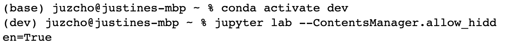
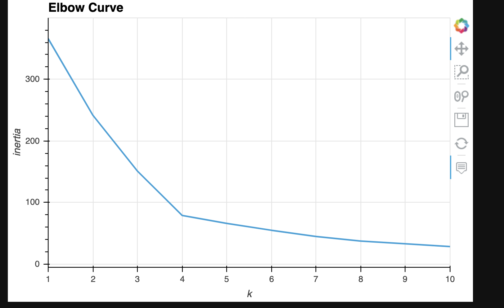
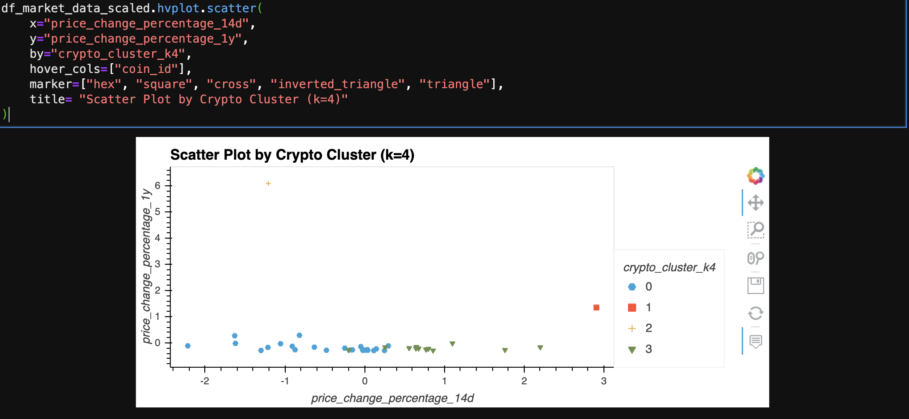
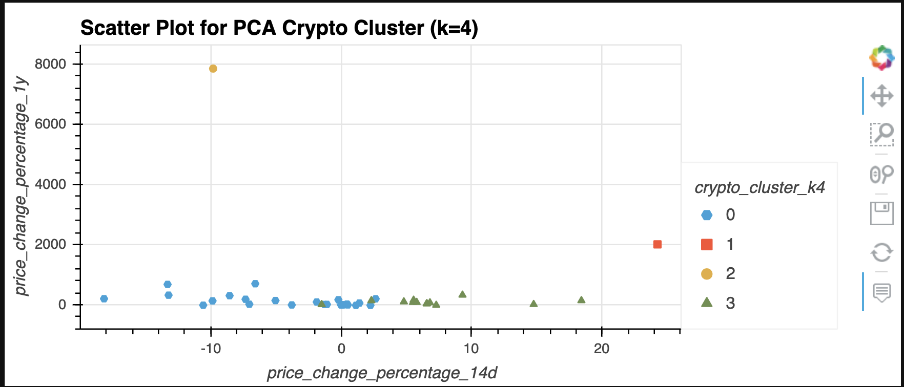
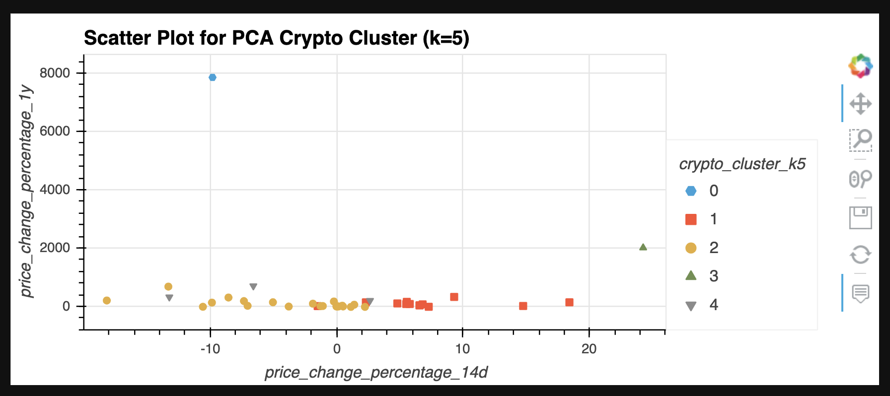

# **Module 10 Challenge: Crypto Investment**

## Crypto Investment 

The Crypto Investment tool is being able to get the KMeans algorithm for segmentations for cryptocurrency profitability. It will show different scatter plots with varying n_clusters to create a robust analysis on the dataframe.

---

## Technologies

This project leverages **[python version 3.8.5](https://www.python.org/downloads/)** with the following packages and modules:

* [pandas](https://pandas.pydata.org/docs/) - This was used to be able to easily manipulate dataframes.

* [Jupyter Lab](https://jupyterlab.readthedocs.io/en/stable/) - This was used to be able to create and share documents that contain live code, equations, visualizations and narrative text.

* [PyVizlot](https://pyviz.org/) -  Python visualization package that provides a single platform for accessing multiple visualization libraries. Two of the libraries are:

    * [hvPlot](https://hvplot.holoviz.org/index.html) - *version  0.7.2* - This was used to be able to have an interactive plotting tool such as a line/bar graph and scatter plot.

* [scikit-learn](https://scikit-learn.org/stable/) - *version 0.24.2* - The scikit-learn or sklearn library contains a lot of efficient tools for machine learning and statistical modeling including classification, regression, clustering and dimensionality reduction.
    * [KMeans](https://scikit-learn.org/stable/modules/generated/sklearn.cluster.KMeans.html) -  It is a powerful unsupervised machine learning algorithm. It is used to solve many complex unsupervised machine learning problems.
    * [StandardScaler](https://scikit-learn.org/stable/modules/generated/sklearn.preprocessing.StandardScaler.html) - It is used to remove the mean and scales each feature/variable to unit variance.
    * [Principal Component Analysis/ PCA](https://scikit-learn.org/stable/modules/generated/sklearn.decomposition.PCA.html) - It is a statistical technique that we use to speed up machine learning algorithms when too many features, or dimensions, exist. 

---
## Installation Guide

### 1. Installing and Running Jupyter notebook

On the terminal, under the conda dev environment, type the code below:

`pip install jupyterlab`

#### * Opening Jupyter notebook

If you have Jupyter Lab already installed, to open your Notebook and be able to view your hidden files, please type this while on your conda dev environment:

`jupyter lab --ContentsManager.allow_hidden=True` 

Once you click ENTER, this will open on your default browser.

---

### 2. Installing PyViz Ecosystem

 - To install the PyViz packages, check that your development environment is active, and then run the following command:

    `conda install -c pyviz hvplot`

- PyViz also require specific version of NodeJS check that your development environment is active, and then run the following command:

    `conda install -c conda-forge nodejs=12`

- To confirm the installation of the PyViz packages, then run the following command:

    `conda list hvplot`
    
    See screenshot below:

### 3. Installing Scikit-learn
- To install the Scikit-learn, check that your development environment is active, and then run the following command:

    `pip install -U scikit-learn`

- To check if scikit-learn is already installed, you can run the following code on your dev environment:

    `conda list scikit-learn`

   

---
## Examples

Here are some of the data visualization we did for this project.

---

## Usage

To be able to get a good analysis on the cryptocurrencies clusters of profitability, we create various scatter plots with differing KMeans cluster.

---

## Contributors

Contributed by: Justine Cho

Email: juz317_cho@yahoo.com

[ LinkedIn](https://www.linkedin.com/in/justinecho)

---

## License

### **MIT License**

Copyright (c) [2021] [Justine Cho]

Permission is hereby granted, free of charge, to any person obtaining a copy
of this software and associated documentation files (the "Software"), to deal
in the Software without restriction, including without limitation the rights
to use, copy, modify, merge, publish, distribute, sublicense, and/or sell
copies of the Software, and to permit persons to whom the Software is
furnished to do so, subject to the following conditions:

The above copyright notice and this permission notice shall be included in all
copies or substantial portions of the Software.

THE SOFTWARE IS PROVIDED "AS IS", WITHOUT WARRANTY OF ANY KIND, EXPRESS OR
IMPLIED, INCLUDING BUT NOT LIMITED TO THE WARRANTIES OF MERCHANTABILITY,
FITNESS FOR A PARTICULAR PURPOSE AND NONINFRINGEMENT. IN NO EVENT SHALL THE
AUTHORS OR COPYRIGHT HOLDERS BE LIABLE FOR ANY CLAIM, DAMAGES OR OTHER
LIABILITY, WHETHER IN AN ACTION OF CONTRACT, TORT OR OTHERWISE, ARISING FROM,
OUT OF OR IN CONNECTION WITH THE SOFTWARE OR THE USE OR OTHER DEALINGS IN THE
SOFTWARE.